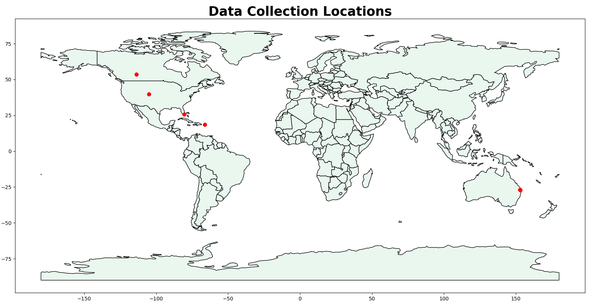
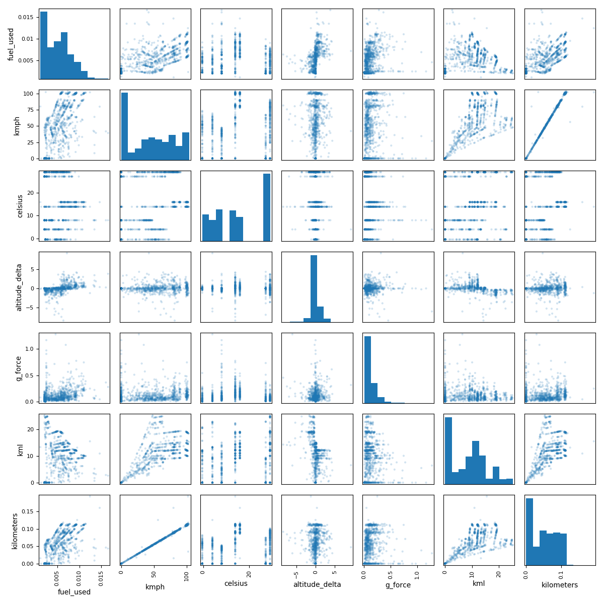
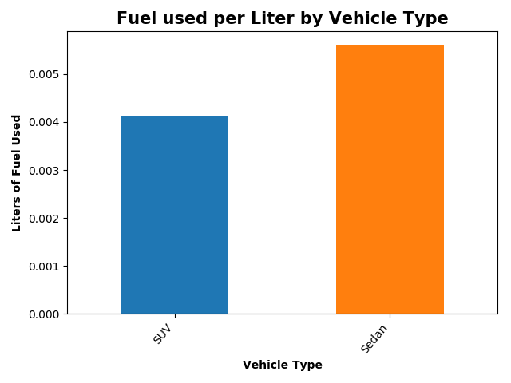
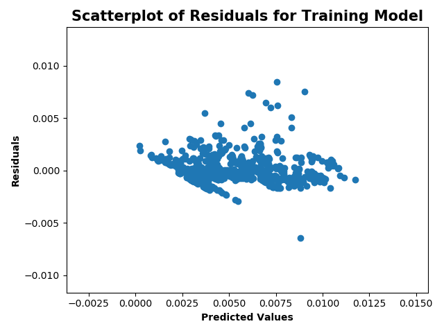

# Sawatch iOS Telemetry Data Report

### Jane Stout

This report provides an analysis of N = 1000 instances of trip information for five vehicles, colleted via iOS telemetry. My goal was to explore and visualize patterns in the data, and ultimately build a model that would predict fuel usage. Table 1 presents variables used in my analysis.

** Table 1. Variable Labels and Definitions Used in the Current Analysis**

| Variable label          | Definition |
|-------------------------|-----------------|
| fuel_used (Target)      | Liters of fuel used since last report           |
| kmph                    | Kilometers per hour (i.e., speed)         |
| celsius                 | Ambient air temperature            |
| altitude_delta          | Delter in meters between last altitude report and current            |
| g_force                 | Calculated g net gravity            |
| kml                     | Kilometers per liter          |
| kilometers              | Kilometers since last report          |
| weather_type_Bad        | Ambient weather was 'Bad' (1: *mist, overcast clouds, broken clouds*) or 'Good' (0: *few clouds, clear sky*)           |
| vehicle_type            | Vehicle Type: SUV (1) or Sedan (0)            |
| latitude                | Degrees latitude          |
| longitude               | Degrees longitude            |

#### Geospatial Analysis

I first plotted latitude and longitude coordinates for each datapoint in the dataset. As seen in Figure 1, there were five distinct data collection locations.

** Figure 1. Geospatial Data Collection Locations**

*Note.* Red dots represent data collection locations.

#### Exporatory Data Analysis

Figure 2 displays a scatter matrix to display (a) histograms and (b) correlations between continuous variables (excluding latitude and longtiude). As seen in the histograms (along the diagonal), several variables contained a large number of zero values. These zero values correspond to instances where vehicles were idle (e.g., at a stop light). Scatterplots also point to some clearly co-linear relationships. For instance, kilometers since last report (kilometers) and kilometers per hour (kmph) have nearly a 1:1 relationship. This will become relevant during the modeling phase of my analysis.

**Figure 2. Scatter Matrix of Continuous Variables**

Figure 3 displays fuel usage as a function of whether the weather was bad (e.g., cloudy; misty) or good (e.g., sunny). Here, we see greater fuel usage when the weather is good.

** Figure 3. Fuel Usage by Weather Type**

Figure 4 displays fuel usage as a function of the type of vehicle: SUV vs. Sedan.

**Figure 4. Fuel Usage by Vehicle Type**

Next, I built a mulitple linear regression model where I regressed fuel_used on kmph, celsius, altitude_delta, g_force, kml, weather_type, and vehicle_type. Note that, given the strong relationship between kmph and kilometers (see Figure 1), I omitted kilometers from the model.

Data were split into training and testing data (75% and 25% of the full dataset, respectively). I ran the model on the training data and assessed colinearity among features in the model. As seen in Table 2, the Variance Inflation Factors (VIFs) were all acceptable (<10).

** Table 2. VIFs for Features in Model**

| Variable label          | VIF coefficient |
|-------------------------|-----------------|
| kmph                    | 9.65            |
| celsius                 | 3.15            |
| altitude_delta          | 1.30            |
| g_force                 | 1.83            |
| kml                     | 9.87            |
| weather_type            | 3.63            |
| vehicle_type            | 4.37            |

I assessed heteroscedasticity of the model residuals by plotting a scatter plot of the predict values and the results (see Figure 5). Residuals were reasonably homoscadastic, though there is evidence of some outliers in the model fit (i.e., scatter dots that notably deviates in the positive/negative direction of the y axis).

** Figure 5. Scatterplot of Predicted Values Versus Residuals

Next, I compared my model for training versus testing data. Table 3 displays model fit information and coefficients.

As seen in Table 3, the training and tesing data both fit the model well (Adjusted R-squareds >= .76). Given that small absolute size of fuel usages per trip, b coefficients are difficult to interpret. However, t statistics coupled with p values allow the reader to interpret the results. The following is an interpretation of coefficients for the tesing model:

- Higher vehicle speed (kpmh) predicts significnatly greater fuel usage; this is a strong predictor
- Higher ambient air temperature (celsius) significnatly predicts less fuel usage; this is a relatively weak predictor
- As elevation level rises (altitude_delta), fuel usage also rises significantly
- As g net gravity increases (g_force), fuel usage also increses; this is a relatively weak predictor
- More kilometers per liter (kml) are associated with less fuel usage
- Outdoor weather (weather_type) does not reliably predict fuel usage
- Whether a vehicle is a SUV versus Sedan (vehicle_type) does not reliably predict fuel usage

**Table 3. Fit statistics and Coefficients for Testing Versus Training Regression Models**

|                <td colspan='5'><b>
 Training Model <td colspan='5'><b>
 Testing Model |
|----------------|----------------|---------|----------|---------|---------|----------------|---------|----------|---------|---------|
|                | <b><i>Adj. R-squared       | <b><i>b | <b><i>SE | <b><i>t | <b><i>p | <b><i>Adj. R-squared | <b><i>b | <b><i>SE | <b><i>t | <b><i>p |
|                | .76            |         |          |         |         | .83            |         |          |         |         |
| constant       |                | .003    | .000     | 18.34   | <.001   |                | .003    | <.001    | 13.48   | <.001   |
| kmph           |                | <.001   | <.001    | 33.26   | <.001   |                | <.001   | <.001    | 22.79   | <.001   |
| celsius        |                | <-.001  | <.001    | -5.53   | <.001   |                | <-.001  | <.001    | -3.10   | .002    |
| altitude_delta |                | .001    | <.001    | 9.85    | <.001   |                | .001    | <.001    | 6.82    | <.001   |
| g_force        |                | .002    | <.001    | 4.94    | <.001   |                | .002    | .001     | 3.96    | <.001   |
| kml            |                | <-.001  | <.001    | -16.12  | <.001   |                | <-.001  | <.001    | -11.22  | <.001   |
| weather_type   |                | <-.001  | <.001    | -2.04   | .04     |                | <-.001  | <.001    | -0.72   | .47     |
| vehicle_type   |                | .001    | <.001    | 5.37    | <.001   |                | <.001   | <.001    | 1.60    | .11     |           

#### Future Directors

In the future, I would like to anlayze telemetric data for electric vehicles to gauge battery efficieny. My personal experience with electric vehicles is that battery life degrades quickly in cold weather and at high speeds. I wonder what other telemetrics can address this type of research question.

It would also be interesting to compare fuel versus battery efficiency for gas-powered versus electric vehicles in terms of financial cost. For instance, given the same distance traveled, same altitude change, etc, which car is more expensive to drive (i.e., cost of fuel versus cost of electricty to charge battery)?

In summary, telemetrics provide an exciting data source that can address practical research questions for the fleet industry.
